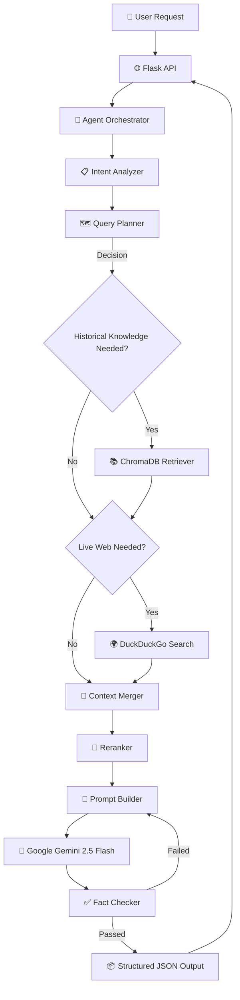

# Sports Quiz Agent — Architecture

This document outlines the architecture of the AI-Powered Sports Quiz Generation Agent.

## High-Level Pipeline

The system is designed as a true AI agent, making decisions at each stage of the pipeline rather than executing a fixed sequence.

## Key Components

### 1. Query Planner (`src/retrieval/query_planner.py`)
Unlike traditional RAG systems that blindly query a vector database, the Query Planner analyzes the user's intent to decide *what* to search for and *where* to search. It generates targeted queries for both historical knowledge (ChromaDB) and live current events (DuckDuckGo).

### 2. Context Merger (`src/retrieval/context_merger.py`)
Intelligently merges heterogeneous sources. Instead of just appending text, it creates structured blocks (e.g., `=== HISTORICAL FACTS ===` vs `=== LIVE UPDATES ===`) so the LLM knows the provenance and reliability of the context.

### 3. Reranker (`src/retrieval/reranker.py`)
Evaluates all retrieved chunks (from both ChromaDB and the web) to select the top most relevant pieces of evidence. It uses a lightweight heuristic scoring system (keyword matching, information density, source reliability) but is designed to be easily swappable with cross-encoder models.

### 4. Fact Checker (`src/agent/fact_checker.py`)
The most crucial piece for a production system. It validates the LLM's output against the provided context to prevent hallucinations. It checks schema validity, duplicate questions, option counts, and evidence support.

### 5. Ingestion Pipeline (`src/embeddings/ingest.py`)
Transforms raw documents (PDFs, TXT) into a searchable vector database.
- **Loader**: Extracts raw text.
- **Cleaner**: Removes PDF artifacts (headers, page numbers, weird whitespace).
- **Chunker**: Splits text into overlapping ~1000-character blocks.
- **Enricher**: Adds rich metadata (sport, topic, word count).
- **Embeddings**: Uses `all-MiniLM-L6-v2` to create 384D vectors.
- **Storage**: Persists to ChromaDB.
